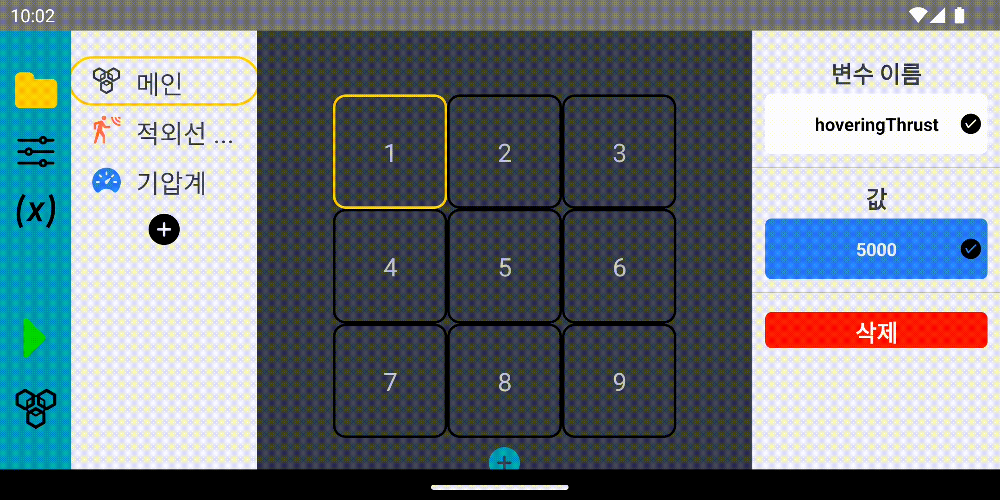
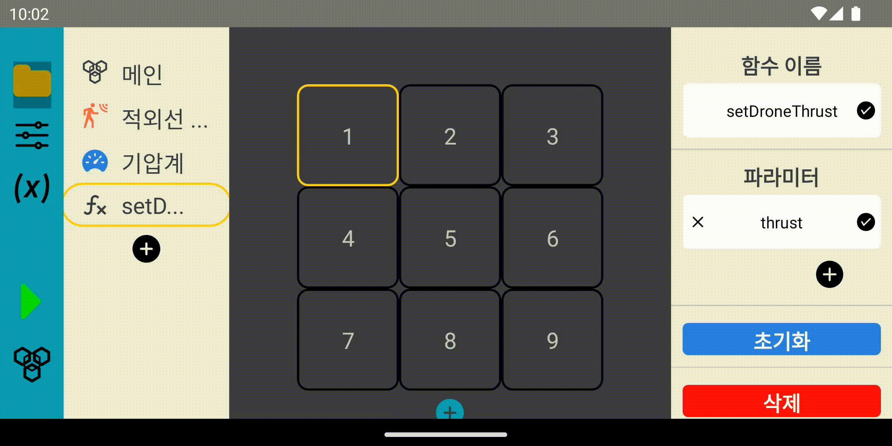

# DBCAV3: Drone Block Coding App Version 3

에듀 테크 스타트업 [랩이즈](https://www.labis.co.kr/)가 개발했던 아이템 중 하나인 교육용 드론과 앱 등을 포함하는 프로젝트.

> [!NOTE]
> 
> - 본 프로젝트는 2022.06에 만들어진 프로젝트의 백업입니다.
> - 현재 [랩이즈](https://www.labis.co.kr/)는 위의 사업을 중단하였습니다.
> - 드론 하드웨어에 포함되는 펌웨어 코드는 [drone](https://github.com/01Joseph-Hwang10/drone) 리포지토리를 참조하세요.

# Background

본 리포는 "완전 모듈형 드론 기반 블록코딩 교육 플랫폼"이라는 사업 기획으로 시작되었습니다.

랩이즈는 이를 통해 SOTA 교육의 최전방에 계신 선생님들이 조금 더 양질의 교육으로 학생들에게 다가갈 수 있도록 도움을 드리고자 했습니다. 

드론의 경우로 예를 들면, 단순히 드론의 조종법만 배우는 것이 아니라, 택배모듈, 소방모듈 등 실생활에 다양하게 적용되면서도 실제 산업에서 활발히 대두되고 있는 실용성 있는 드론 교육을 지향하였고, 또한 단순히 드론 교육만 하는 것이 아니라 이를 통해 학생들이 블록코딩을 통해 프로그래밍의 기본적인 개념을 익히고, 이를 실제로 적용해보며 프로그래밍에 대한 흥미를 느끼고, 이를 통해 미래의 개발자로도 성장할 수 있는 발판을 마련해 드리고자 하였습니다. 

이러한 양질의 교육 컨텐츠와 이를 교수할 수 있는 수업 자료, 메뉴얼 등을 방과후교실이나 영재교육원의 강사분들께 제공하여 4차 산업혁명에 대비한 교육을 지원하고자 했습니다.

# Main Tech Stacks

- react-native
  - @react-navigation
  - react-native-ble-plx
  - raect-native-redash
- React Hook Form
- Redux
  - @reduxjs/toolkit
- styled-components

# Showcase

## Drone Configuration

실제 조립형 드론 하드웨어의 구성에 맞게 애플리케이션 설정을 수정하는 과정입니다.
교육용 드론은 모터와 여러 종류의 센서를 최대 6개 탈부착할 수 있는 육각형의 형태입니다.
또한 아래 페이지에서 드론과의 블루투스 연결 설정을 할 수 있습니다.

| Drone Configuration | 
| :--: |
|  | 

## Block Coding Page

메인 블록코딩 페이지에서는 드론에 대한 기본적인 프로그래밍을 할 수 있습니다.
기본적인 프로그램 흐름과 관련된 키워드, 변수, 변수의 스코프, 함수, 그리고 드론의 하드웨어 특정적인 커멘드도 추가되었습니다.

Configure Function | Variable Assignment
:--: | :--:
 | 

Programming subfunction | Programming main function
:--: | :--:
 | 

# Getting Started

```bash
# Install dependencies using `yarn.lock`
yarn install --immutable --immutable-cache --check-cache

# Run dev server for applications
yarn android # Run app on android platform
yarn ios # Run app on ios platform
```

# Project Structure

- apps/app/src: 모든 소스코드를 포함합니다.
  - components: 재사용 가능한 컴포넌트를 포함합니다.
  - context: React Context API를 이용한 상태 관리를 위한 컨텍스트를 포함합니다.
  - hooks: 편의를 위해 작성한 커스텀 훅을 포함합니다.
  - modules:
    - block-definitions: 블록코딩 앱에서 사용하는 블록들의 정의를 포함합니다.
      - base: 모든 블록이 상속하는 기본 블록을 포함합니다.
      - classes: 객체지향 프로그래밍 관련 블록을 포함합니다. 이 부분은 프로젝트가 중도 폐기되어 개발되지 않았습니다.
      - functions: 함수와 관련한 블록을 포함합니다. 본 애플리케이션의 모든 블록코드는 하나의 루트 함수로 시작되어, 그 내부에서 다른 함수 또한 호출할 수 있는 방식이었습니다. (See [here](./src/redux/slices/workspace.ts))
        - blocks: 프로그래밍 언어에 필수로 존재하는 조건문, 반복문 등의 구문과, 드론을 컨트롤할 수 있는 블록을 포함합니다.
      - variables: 변수와 관련한 블록을 포함합니다.
    - bluetooth: 블루투스 통신을 위한 함수 및 객체를 포함합니다.
    - event: 옵저버 패턴을 이용한 이벤트 관리를 위한 함수 및 객체를 포함합니다. (See [here](./src/modules/event/event.ts))
    - location: BLE 사용을 위한 위치 권한 요청을 위한 함수 및 객체를 포함합니다.
    - transpiler: 애플리케이션의 블록코드를 32bit word로써 드론이 이해할 수 있는 바이너리로 변환하는 함수를 포함합니다. (See [here](./src/modules/transpiler/transpiler.ts))
  - navigation: React Navigation을 이용한 네비게이션을 위한 컴포넌트를 포함합니다.
  - redux: Redux를 이용한 상태 관리를 위한 코드를 포함합니다.
    - slices: Redux Toolkit을 이용한 리듀서를 포함합니다.
    - queries: 상태를 조회하는 것이 복잡한 경우에 사용하는 셀렉터를 포함합니다.
  - theme: 애플리케이션의 테마, 스타일링 관련 상수를 포함합니다.
  - tools: 편의를 위해 작성한 함수를 포함합니다.
  - utils: 편의를 위해 작성한 prototype overrides, 타입 정의 등을 포함합니다.
  - views: 애플리케이션의 페이지를 포함합니다.
    - config-drone.tsx: 드론 모듈/센서 설정을 변경할 수 있는 페이지입니다. (아래 사진 참조)
    - editor.tsx: 드론을 프로그래밍하기 위한 블록코드 에디터 페이지입니다. (아래 사진 참조)

# Key Takeaways

## Observer Pattern

### Problem

본 프로젝트에는 여러 곳에 옵저버 패턴이 적용되어 있습니다. 이는 상태 관리를 Redux 에만 의존하는 것이 코드 유지보수 측면에 있어 비효율적이고 개발에 어려움을 가중한다 판단했기 때문입니다. 이와 같은 문제때문에 Redux에는 상태를 저장하는 역할만을 위임하고, 상태 변화를 감지하고 그에 따른 행동을 수행하는 역할은 옵저버 패턴을 이용해 구현했습니다.

### Implementation

먼저 [event.ts](./src/modules/event/event.ts) 의 `EventRegistry.on`을 통해 각 함수에서 원하는 리스너를 할당하고 상태 변화가 필요할 때 `EventRegistry.emit` 을 통해 레지스터된 리스너들에게 상태 변화를 알립니다.

위에 대한 예로 [CompareRowIf](./src/components/editor/aux/aux-conditional/compare-row-if.tsx), [InputDialog](./src/components/editor/dialog/input-dialog.tsx), [OptionItem](./src/components/editor/palette/option-list/option-item.tsx)가 있습니다. 

만약 유저가 [위 사진](#editortsx) 우측 "조건" 섹션의 왼편의 파란 셀을 터치하면 아래의 함수가 트리거됩니다.

```ts
const onLeftPress = () => {
  dispatch(setOptionMode(['variable', 'raw']));
  EventRegistry.on<IOptionItem<Comparee>>(
    Event.onChangeOption(),
    ({data}) => {
      condition.setLeft(data);
    },
  );
};
```

이로써 `EventRegistry`에 옵션(e.g. 변수, 비교연산자)이 바뀔 경우에 ([위 사진](#editortsx) 좌측 사이드바에 함수 목록 대신 표시됩니다.) `condition.setLeft(data)`가 호출됨으로 인해 `condition` 객체의 상태가 변화하게 됩니다. 이는 예를 들어 `OptionItem`에서 아래와 같은 코드가 호출되면 트리거됩니다.

```ts
const onPress = () => {
  if (type === 'input') {
    dispatch(setInputOpened(true));
  } else {
    EventRegistry.emit<IOptionItem>(Event.onChangeOption(), option);
  }
};
```

옵션을 선택하면 위 함수가 호출되고, raw input이 아닌 경우에 `EventRegistry.emit`을 통해 `EventRegistry.on`에 등록된 리스너들에게 상태 변화를 알립니다.

또한 각 [블록정의](./src/modules/block-definitions/)는 `AbstractBlock`을 상속하고 `actionChain`이라는 메서드를 구현해야하며, 이 메서드는 상속과 참조를 통해 Redux Store로 연결되는 액션의 체인을 구성합니다.

예를 들어 위에서 언급한 `condition` 객체의 구현은 [Condition](./src/modules/block-definitions/functions/blocks/condition.ts)이며, 이 객체의 `actionChain` 메서드는 `(refBlock as ConditionalBlock).updateCondition(this);`를 통해 자신이 종속되어 있는 조건 관련 구문에 조건이 업데이트됨을 알립니다. `ConditionalBlock`을 구현하는 블록 중 하나인 [IfBlock](./src/modules/block-definitions/functions/blocks/if.ts)는 이러한 `actions`를 실행하고 자신이 종속되어 있는 함수에 `this.funcRef!.refFunc?.setBlock(this);`를 통해 블록 관련 상태가 업데이트됨을 알립니다. 이는 [FunctionBlock](./src/modules/block-definitions/functions/function.ts)의 `setBlock` 메서드를 부르게 되고, 이는 다시 `actionChain` 메서드를 호출해 `actions`를 실행하고 `store.dispatch` 및 `update` 메서드를 통해 최종적으로 변경된 모든 상태를 한 번에 업데이트합니다.

정리하면, `condition` 객체에서 어떤 값이 바뀌게 되면 `Condition` -> `ConditionalBlock` (`IfBlock`) -> `FunctionBlock` -> Redux Store 순으로 데이터가 순차적으로 흘러가 상태가 업데이트됩니다.

### Impact

- 옵저버 패턴을 이용한 블록코드간 상태 관리를 통해 코드의 유지보수가 훨씬 쉬워졌습니다.
  - 기본적인 블록 (If, For) 외에 다른 추가적인 블록을 빠른 속도로 추가할 수 있었습니다.
  - Redux와 관련한 로직으로 복잡해지는 컴포넌트의 코드를 직관적으로 관리할 수 있었습니다.
